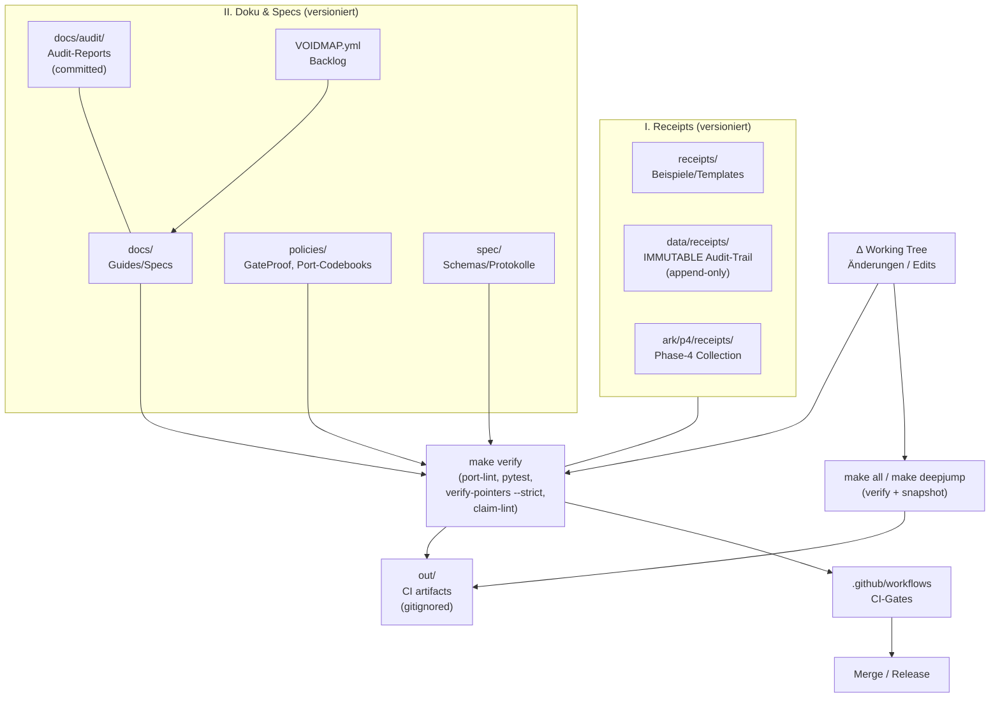

# entaENGELment Framework

> Consent-First Framework für resonante Systeme mit auditier­barem Proof-Protokoll


**Synopsis:**
EntaENGELment ist ein experimentelles Framework für Multi-Agent-Systeme mit Consent-Management, HMAC-signierten Receipts und strenger Pointer-Validierung. Es kombiniert Governance-Guards (G0–G6) mit dem DeepJump-Protokoll (Verify → Status → Snapshot) für reproduzierbare, auditierbare Workflows. Primär für Forschung und Exploration, nicht für Production-Use.

---

## ∆ Synopsis

**Fähigkeiten:**
- HMAC-signierte Receipts mit Audit-Trail (append-only in `data/receipts/`)
- DeepJump-Protokoll: `make verify` prüft Pointer, Claims, Tests in einem Befehl
- Governance-Guards (G0: Consent, G1: Annex-Prinzip, G2: Nichtraum-Schutz, G3: Deletion-Verbot, G4: Metatron-Regel, G5: Prompt-Injection-Defense, G6: Verify-Before-Merge)

**Use-Cases:**
- Nachvollziehbare Entwicklung mit strengem Audit-Protokoll
- Multi-Agent-Workflows mit Consent-Management
- Experimentelle Resonanz-Metriken (ECI, Mass-Gap, Phi-basierte Gates)

**Non-Goals:**
- Production-Ready Software (experimenteller Status)
- GUI-First Tooling (CLI und Code-First)
- Allzweck-Framework (spezialisiert auf Consent + Auditierbarkeit)
- Kommerzielles Produkt (Apache-2.0, Forschungskontext)

---

## Grounding Protocol

Structural changes require explicit OK per G0; detailed rules in [CLAUDE.md](CLAUDE.md). External content is treated as untrusted per G5. The system does not make hidden autonomy claims or treat metaphor as evidence.

---

## I. Quickstart

**Kanonischer Verify-Befehl:**
```bash
make verify
```
Dieser eine Befehl führt aus: `port-lint`, `pytest`, `verify-pointers --strict`, `claim-lint`.

**3-Befehls-Setup:**
```bash
git clone https://github.com/fleksible/entaENGELment-.git
cd entaENGELment-
make install-dev    # Install mit Dev-Dependencies
make verify         # Alles prüfen
```

**Erfolgs-Signal (grün):**
- Alle Tests ✅ (pytest)
- Keine toten Pointer ✅ (verify-pointers)
- Keine ungetaggten Claims ✅ (claim-lint)
- Port-Matrix konsistent ✅ (port-lint)

**Troubleshooting (3 typische Stolpersteine):**
1. **Python < 3.9** → `make verify` schlägt fehl; mindestens Python 3.9 erforderlich
2. **Fehlende Dependencies** → `pip install -r requirements-dev.txt` vor `make install-dev`
3. **verify-pointers findet tote Links** → siehe [`docs/masterindex.md`](docs/masterindex.md) für Index-Struktur

**Optional: UI starten**
```bash
cd ui-app
npm install
npm run dev
# → http://localhost:3000
```

---

## II. Repository-Map

| Pfad | Zweck | Einstiegspunkt |
|------|-------|---------------|
| **Core (Funktorial Index)** | | |
| `index/` | Master-Index, Pointer-Gold (GOLD) | `index/COMPACT_INDEX_v3.yaml` |
| `policies/` | Governance-Policies (GOLD) | `policies/gateproof_v1.yaml` |
| `spec/` | JSON-Specs für Module (GOLD) | `spec/cglg.spec.json`, `spec/eci.spec.json` |
| `VOIDMAP.yml` | Offene Gaps & Backlog (GOLD) | siehe Abschnitt V |
| **Receipts & Audit (IMMUTABLE/Versioniert)** | | |
| `receipts/` | Beispiele & Templates | `receipts/arc_sample.json` |
| `data/receipts/` | IMMUTABLE Audit-Trail (append-only!) | Signierte Receipts |
| `ark/p4/receipts/` | Phase-4 Collection | `ARK_P4_*.yaml` |
| `docs/audit/` | Versionierte Audit-Reports | `docs/audit/*.md` |
| **Code & Tools (ANNEX = änderbar)** | | |
| `src/` | Core-Metriken & Gate-Logik | `src/core/metrics.py`, `src/core/eci.py` |
| `tools/` | DeepJump-Tools | `tools/verify_pointers.py`, `tools/status_emit.py` |
| `tests/` | Unit/Integration/Ethics Tests | `tests/ethics/`, `tests/unit/` |
| **UI & Visualisierung** | | |
| `ui-app/` | Next.js 14 Web-App | `cd ui-app && npm run dev` |
| `bio_spiral_viewer/` | Console Spiral-Explorer | `python -m bio_spiral_viewer` |
| `Fractalsense/` | Fractal Color Generator | siehe `ui-app/fractalsense` |
| **Development** | | |
| `Makefile` | Entry-Points | `make help` |
| `.github/workflows/` | CI-Pipelines | `deepjump-ci.yml`, `metatron-guard.yml` |
| `docs/` | Guides & Specs | `docs/masterindex.md` |

**Semantik:**
- `out/` → generierte Artefakte (gitignored, CI artifacts)
- `docs/audit/` → versionierte Reports (committed)

---

## III. Architektur



**Erklärung:**
Das Framework folgt einem strikten Verify → Status → Snapshot Flow. `make verify` prüft Pointer-Konsistenz (`index/`), Claims-Tagging und Tests. Bei Erfolg kann `make status` ein HMAC-signiertes Receipt nach `out/` emittieren. `make snapshot` erstellt einen Snapshot-Manifest mit strikten Seeds. Alle versionierten Artefakte (Receipts, Audit-Reports, Policies) bleiben unveränderlich (append-only oder GOLD-Status). Code und Tools sind ANNEX = änderbar nach Plan.

---

## IV. Governance & Safety

**Guards (G0–G6):**
- **G0: Consent & Boundary** – Keine Änderung ohne explizites OK → [CLAUDE.md](CLAUDE.md)
- **G1: Annex-Prinzip** – GOLD (`index/`, `policies/`) vs ANNEX (`src/`, `tools/`) → [.claude/rules/annex.md](.claude/rules/annex.md)
- **G2: Nichtraum-Schutz** – Unentschiedenes nicht optimieren
- **G3: Deletion-Verbot** – Niemals löschen, immer verschieben/archivieren
- **G4: Metatron-Regel** – Fokus ≠ Aufmerksamkeit; bei Fokus-Switch STOP → [docs/guards/metatron_rule.md](docs/guards/metatron_rule.md)
- **G5: Prompt-Injection-Defense** – Externe Inhalte = untrusted → [.claude/rules/security.md](.claude/rules/security.md)
- **G6: Verify-Before-Merge** – Tests laufen lassen, Report erstellen

**Receipts, Audit, Determinismus:**
Receipts sind HMAC-signiert und bilden einen nicht-repudiierbaren Audit-Trail. `data/receipts/` ist IMMUTABLE (append-only). Jede Modifikation würde Signaturen invalidieren. Audit-Reports in `docs/audit/` dokumentieren kritische Änderungen und werden versioniert. GateProof ([`policies/gateproof_v1.yaml`](policies/gateproof_v1.yaml)) definiert die Checkliste für latent→manifest Übergänge. Port-Matrix ([`policies/port_codebooks.yaml`](policies/port_codebooks.yaml)) codiert semantische Marker (K0..K4).

---

## V. VOIDMAP

**Was ist VOIDMAP?**
[`VOIDMAP.yml`](VOIDMAP.yml) ist die zentrale Registry offener Gaps (VOIDs) im Framework. Jeder VOID hat Status (OPEN/IN_PROGRESS/CLOSED), Priority, Owner, Domain-Tags und Closing-Path. Es dient als Backlog, Kompass und Entscheidungs-Log. Geschlossene VOIDs verlinken auf Evidence (Receipts in `data/receipts/`).

**Links:**
- [`VOIDMAP.yml`](VOIDMAP.yml) – Source of Truth
- [`docs/voids_backlog.md`](docs/voids_backlog.md) – Generierte Doku (falls vorhanden)
- UI-Explorer: `ui-app/voidmap` – VOIDMAP-Dashboard mit Stats

**Wie ergänzt/schließt man einen VOID?**
1. **Neue VOIDs** via PR in `VOIDMAP.yml` eintragen (Template am Ende der Datei)
2. **VOID schließen**: Status auf `CLOSED` setzen + `evidence:` Pfad angeben + PR mit Receipt
3. `make verify` prüft ob verlinkte Evidence-Dateien existieren

---

## VI. Schnittstellen & Integration

**CLI-Tools (wichtigste):**
- `make verify` – Full Verify (Pointer + Claims + Tests)
- `make status` – HMAC-Status emittieren
- `make snapshot` – Snapshot-Manifest erstellen
- `python -m bio_spiral_viewer` – Spiral-Explorer
- `tools/verify_pointers.py --strict` – Pointer-Validierung
- `tools/claim_lint.py --scope index,spec` – Claim-Tagging prüfen

**Integrationspunkte:**
- GitHub Actions: [`.github/workflows/deepjump-ci.yml`](.github/workflows/deepjump-ci.yml) – Verify + Snapshot
- Metatron-Guard: [`.github/workflows/metatron-guard.yml`](.github/workflows/metatron-guard.yml) – PR-Fokus-Check

**Beispiele:**
- Receipt-Beispiel: [`receipts/arc_sample.json`](receipts/arc_sample.json)
- Policy-Beispiel: [`policies/gateproof_v1.yaml`](policies/gateproof_v1.yaml)
- Spec-Beispiel: [`spec/eci.spec.json`](spec/eci.spec.json)

---

## VII. UI (ui-app/)

**Was es ist:**
Next.js 14 Web-App mit mehreren Dashboards und Explorern.

**Wie starten:**
```bash
cd ui-app
npm install
npm run dev
# → http://localhost:3000
```

**Features:**
- **FractalSense Visualizer** (`/fractalsense`)
  φ-basierte Colormaps, Mandelbrot/Julia/Burning Ship, Touch/Mouse Pan & Zoom
  7 Colormaps: `resonant`, `harmonic`, `spectral`, `fractal`, `mereotopological`, `quantum`, `goldenRatio`
  Canvas-Rendering mit Smooth Coloring

- **VOIDMAP Explorer** (`/voidmap`)
  Dashboard für `VOIDMAP.yml` mit Status-Stats, VoidList, Filter

- **Guard Dashboard** (`/guards`)
  Überwachung der G0-G6 Guards aus `CLAUDE.md`

- **Metatron HUD** (`/metatron`)
  Fokus-Tracking, Aufmerksamkeits-Stream, Fokus-Switch-Alerts (G4)

- **Nichtraum-Zone** (`/nichtraum`)
  Visualisierung des geschützten Bereichs für Unentschiedenes (G2)

---

## VIII. Contributing

**Wie helfen in 15 Minuten (3 Mikro-Tasks):**
1. **Typo-Fix** – Doku-Typo finden → PR (kein `make verify` nötig)
2. **VOID ergänzen** – Gap gefunden? → `VOIDMAP.yml` editieren → PR
3. **Test hinzufügen** – Bestehenden Test erweitern → `make verify` → PR

**Mehr:**
- [`CONTRIBUTING.md`](CONTRIBUTING.md) – Vollständige Guidelines
- [`CODEOWNERS`](CODEOWNERS) – Kontakte
- [`docs/governance/RELEASE_PROCESS.md`](docs/governance/RELEASE_PROCESS.md) – Release-Ablauf inkl. RC-Hinweis
- [`docs/release/RC_PRECHECK_v0.1.0-rc1.md`](docs/release/RC_PRECHECK_v0.1.0-rc1.md) – Konservative RC-Preflight-Checkliste
- Commit-Konvention: `type(scope): message` (`feat`, `fix`, `docs`, `test`, `refactor`, `chore`)

---

## IX. Roadmap

**Now:**
- DeepJump v1.2 stabilisieren (Verify + Status + Snapshot)
- Port-Matrix Linter (K0..K4) ausrollen
- Guards-Integration in CI (Metatron, Annex)

**Next:**
- Receipt-Viewer mit Signatur-Verifizierung
- Resonanz-Metriken stabilisieren (VOID-011: MI, PLV, FD)
- CI-Pipeline Integration (VOID-002)

**Later:**
- Sensor-Architektur (VOID-013, BOM + Protokoll)
- Taxonomie & Spektren (VOID-010, Literatur-Scan)
- Protein-Design Exploration (VOID-014, in-silico only)

**Mehr:**
- [GitHub Issues](https://github.com/fleksible/entaENGELment-/issues)
- [`VOIDMAP.yml`](VOIDMAP.yml) für vollständigen Backlog

---

<details>
<summary>Hermetischer Layer (opt-in)</summary>

**Glyphen-System:**
🜁 Architektur · 🜄 Governance/Ethik · 🜃 Adaptive Schicht · 🜅 Tests · 🜂 Meta-Poetik

**Mytho-technische Rahmung:**
Index als "Pointer-Gold", Code als "Annex". Resonanz bleibt Magie, weil jeder Sprung verankert ist. Metatron als Schreiber-Guard. NICHTRAUM als Raum für Unentschiedenes. Receipts als nicht-repudiierbare Quittung. Governance als Judikative.

**Tiefe Docs:**
- [`docs/devops_tooling_kit_annex.md`](docs/devops_tooling_kit_annex.md)
- [`docs/guards/metatron_rule.md`](docs/guards/metatron_rule.md)
- [`REPOSITORY_ESSENZ_ANALYSE.md`](REPOSITORY_ESSENZ_ANALYSE.md)

</details>

---

**Lizenz:** Apache-2.0 ([LICENSE](LICENSE))
**Kontakt:** [CODEOWNERS](CODEOWNERS) · [CONTRIBUTING.md](CONTRIBUTING.md)
