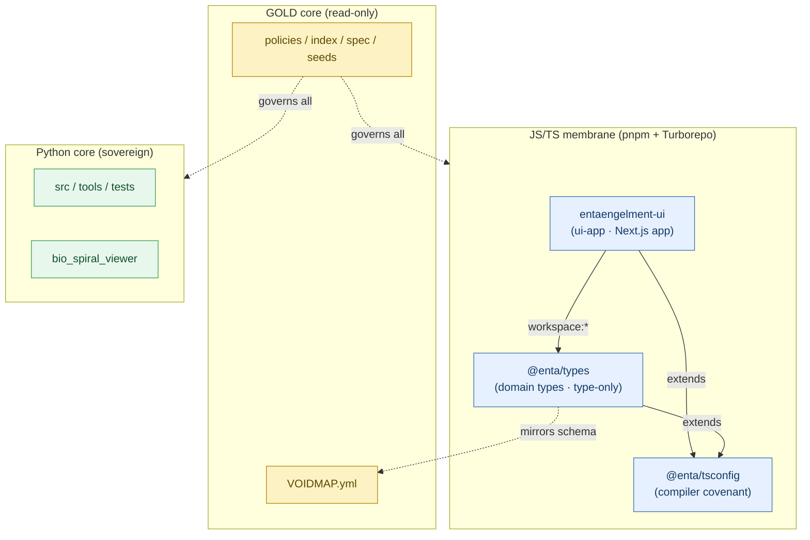

# Monorepo Topology

Dependency and domain topology of the EntaENGELment workspace. Arrows point
from consumer to dependency (flow is leaf-ward; the graph is acyclic — see
`SYNTHBIOSIS.md` §4, Axiom S6).

## Reading the graph

- **`ui-app`** is a leaf consumer: it depends on `@enta/types` (`workspace:*`)
  and extends `@enta/tsconfig`. It does not depend on the Python core.
- **`@enta/types`** is the single source of truth for domain types and *mirrors*
  the GOLD `VOIDMAP.yml` schema as a read-only consumer (dotted arrow — no write
  relationship).
- **`@enta/tsconfig`** is the shared compiler covenant every TS package extends.
- The **Python core** is a separate sovereign domain with its own toolchain; the
  JS membrane neither imports from nor gates it.
- **GOLD policies** govern every domain but are edited by none of them.

Turbo task graph: `typecheck`/`build` flow `@enta/tsconfig → @enta/types →
ui-app` via `dependsOn: ["^typecheck"|"^build"]`.
